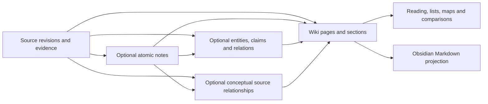
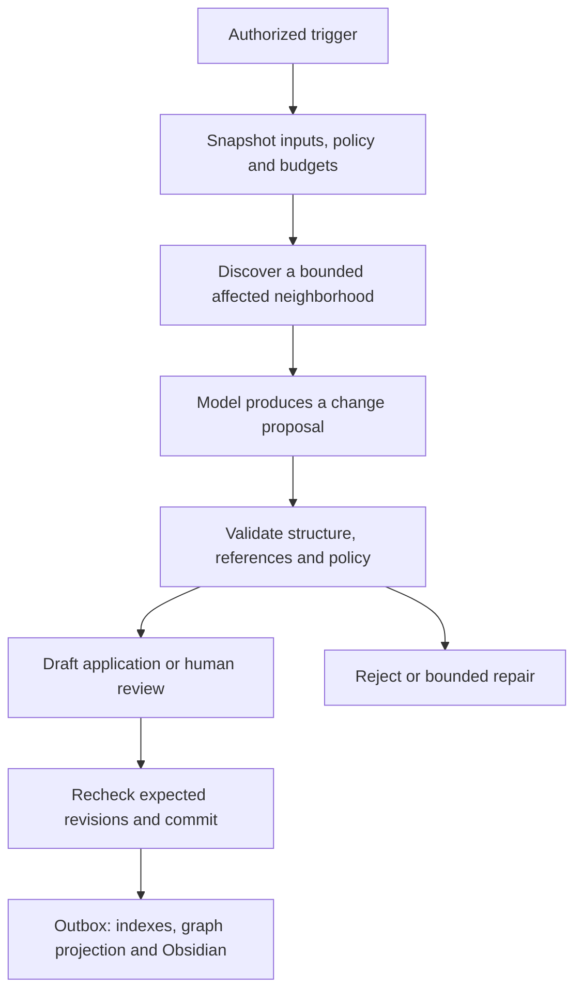

# Hybrid second brain: implementation plan

Status: implementation in progress. M1's non-AI workspace and M2's restricted
organization executor are accepted; their validation records are below.
M3 is accepted after paired real-model trials and coordinator validation;
M3b is accepted after reviewed maintenance/restore trials; M4 is accepted after real Obsidian projection/recovery tests. M5 is accepted after actual editorial sync, restart and conflict tests; M6 is deferred. The section 7 TypeScript executor decision passed the M2
gate with Luna as the semantic reference and local models evaluated on a
best-effort basis. Baseline reviewed on
2026-09-08 against commit `a0ee57a`, including the conceptual source relationship
pipeline. The agreed product constraints are recorded in
[the second-brain rules](../rules/second-brain.md); existing matching behavior
is governed by [the source relationship rules](../rules/source-relations.md).
New table/service names, wiki budgets, layouts and milestone boundaries below
are planning proposals. Existing source relationship contracts and settings
are reuse constraints, not new wiki implementation work.

## Contents

- [Outcome and scope](#1-intended-outcome)
- [Existing implementation and gaps](#2-existing-implementation-and-gaps)
- [Optional processing and catalog participation](#3-participation-and-processing-semantics)
- [Knowledge model and hierarchy](#4-knowledge-model-and-editorial-hierarchy)
- [Consultation and retrieval](#5-flexible-consultation)
- [Visual experience](#6-visual-experience)
- [Harness and editable instruction settings](#7-bounded-organization-harness)
- [Incremental, weekly/monthly maintenance and cleanup](#8-incremental-maintenance-and-atomic-notes)
- [Obsidian projection: stage 1](#9-obsidian-stage-1-replicated-readable-wiki)
- [Obsidian reverse sync: stage 2](#10-obsidian-stage-2-plugin-editing-back-to-the-application)
- [Milestones and ownership](#11-implementation-sequence-and-ownership)
- [Evaluation and acceptance](#12-evaluation-and-acceptance-scenarios)
- [Decisions to validate](#13-decisions-to-validate-during-the-first-milestones)
- [References](#14-design-references)

## 1. Intended outcome

Memora Eterna should turn an accumulating library into an understandable,
inspectable body of knowledge. A person can find a source, explore an idea,
read a synthesis across sources, examine disagreements, and follow every
derived assertion back to its evidence. Useful discoveries can become durable
knowledge instead of disappearing into a conversation.

The first presentation is a wiki. Atomic notes, source documents, conceptual
source relationships, canonical entities, and entity relations remain
independently useful. The wiki is an editorial layer over these objects, not
a replacement for them. PostgreSQL remains canonical; AGE, embeddings,
rendered pages, and Obsidian files are
projections or retrieval aids.

Success includes a useful experience with no atomic notes, no graph extraction,
and no model loaded. AI synthesis and organization require explicit processing
selection or an enabled policy, but catalog access and manual organization do
not. Obsidian projection is part of the first release; reliable reverse sync
for the new wiki content is a second release, designed into the first.

### Agreed constraints and proposed defaults

| Area | Constraint or proposed default |
| --- | --- |
| Catalog coverage | Every imported source remains discoverable, including metadata-only containers and sources without notes. |
| Atomic notes | Optional per source or processing selection. Wiki work never enables note generation implicitly. |
| Source relationships | Reuse persisted conceptual connections as optional organization/retrieval context, with original evidence from both endpoints. Source matching and entity extraction remain separate selections. |
| Evidence | Synthesis can cite source revision/chunk/SourceSpan directly; notes and graph elements are optional additional context. |
| AI autonomy | Proposed default: create/update unreviewed AI drafts; propose changes to human-edited or reviewed content. |
| Consultation | Search and questions are read-only; saving a useful answer is an explicit action. |
| Storage | Canonical identities and revision history remain in SQL. Markdown is a content/export format. |
| Obsidian | Project within the configured managed root only when sync is enabled, a vault is configured, and sync is not paused. |
| Human editing | Desktop and later plugin edits use the same application validation and revision rules. |
| Runtime | Selected initial approach: application-specific TypeScript state executor, Zod and existing PostgreSQL jobs/workers; retain `AiModelAdapter`. LangGraph.js is the conditional external alternative after M2. |
| User control | A dedicated Organization and harnesses settings section exposes instructions by function and domain, with free guidance and guarded advanced prompts. |
| Maintenance | Configurable weekly/monthly organization and cleanup, with budgets, explicit scope and reviewable structural changes. |

## 2. Existing implementation and gaps

The following are code observations, not claims that the complete workflows
have been validated in a running desktop or an actual Obsidian vault.

| Existing area | Reuse | Required extension or correction |
| --- | --- | --- |
| [Processing DAG](../packages/domain/src/hierarchical-ingestion.ts) | Independent notes/entity graph; `sourceMatching` depends on summaries and embeddings, not notes or entity extraction, and belongs to new `full_knowledge` plans. | Add explicit organization selection without expanding saved immutable plans or changing import-only semantics. |
| [Knowledge service](../apps/desktop/src/main/services/knowledge-service.ts) | Summaries with grounded concepts, note generation/matching, entity extraction, source matching and source evidence. | Add cross-source page maintenance and impact discovery above these services. |
| [Source matching](../apps/desktop/src/main/services/source-relation-processing.ts) | Bounded cross-root discovery, note-link validation, RRF diversity, one repair, positive/negative decision reuse and resumable per-root budgets. | Consume its qualified results; do not create a competing wiki matcher or silently schedule matching. |
| [Source relationship persistence](../packages/db/src/repositories/sourceRelationRepository.ts) and [contracts](../packages/domain/src/source-relations.ts) | Canonical directed idea connections, two-sided evidence snapshots, independent review with optimistic timestamps, currentness and paginated details. | Add scoped wiki read adapters, section dependencies and transactional change notifications; keep canonical ownership here. |
| [Knowledge contracts](../packages/domain/src/knowledge.ts) | Notes, note relations, questions, review states, source links. | Version editorial bodies and protect human edits independently of review status. |
| [Canonical schema](../packages/db/src/schema.ts) | Sources, revisions, chunks, entities/claims, notes, `source_relations`, `source_relation_evidence`, `source_matching_decisions`, `source_matching_runs`, jobs, AI audit and sync. | Add wiki records and organization state; reference existing source relationship records rather than duplicate them. |
| [Search service](../apps/desktop/src/main/services/search-service.ts) | Text/vector/AGE-assisted evidence retrieval and typed results; its current `relation` kind denotes entity relations. | Add page/section and distinct conceptual relationship results, common scope/review/freshness filtering and cited answers. |
| [Graph dashboard](../apps/desktop/src/renderer/components/KnowledgeGraphDashboard.tsx) and [relation list](../apps/desktop/src/renderer/components/SourceRelationsList.tsx) | Sources defaults to conceptual connections; entity connections are an alternative. Reuse hierarchy collapse/expand, type icons, evidence/review cards, pagination and contextual navigation. | Add page projection and scoped neighborhoods while retaining the existing source/note views. |
| [AI execution queue](../apps/desktop/src/main/services/ai-execution-queue.ts) and [monitoring](../apps/desktop/src/main/services/monitoring-service.ts) | One FIFO inference queue, canonical task audit and independently prunable operation telemetry. | Route wiki calls through the same AI service; add organization context without a second inference queue or audit store. |
| [Editorial source save](../packages/db/src/repositories/sourceEditingRepository.ts) | Optimistic concurrency and new documents/revisions preserve earlier evidence. | Share this application behavior with plugin-originated source edits. |
| [Obsidian projection](../apps/desktop/src/main/services/obsidian-projection.ts) | Managed identity frontmatter, human-readable paths, hierarchy paths, relation links. | Add wiki pages/indexes, catalog-only references, section anchors, and portable citation links. |
| [Obsidian sync](../apps/desktop/src/main/services/obsidian-sync-service.ts) | Projection hash checks, conflict detection, present-file reconciliation, explicit deletion handling. | Add revision-aware wiki targets, durable apply/acknowledgment state, and safe generated/editorial region handling. |
| [Plugin](../apps/obsidian-plugin/src/main.ts) | Create/modify/rename/delete listeners, reconciliation, gateway client. | Add wiki capability negotiation, durable pending edits, debounce, visible errors, and conflict resolution. |
| [Integration contracts](../packages/integration-contracts/src/index.ts) | Versioned frontmatter and change events for sources and notes. | Add wiki types and revision-aware commands without letting an old plugin reinterpret them. |

### Prerequisites that must not be hidden by new UI

1. `atomicNoteRelationRepository.upsert` still sorts note IDs into one pair;
   semantic direction comes from matching metadata. Define explicit directed
   note endpoints and uniqueness before expanding note relation editing. This
   limitation does not apply to `source_relations`, which already stores actual
   directed source/chapter endpoints and multiple idea connections per pair.
   Reuse the existing metadata resolver for safe note-to-source consumption;
   preserve ambiguous legacy links for review instead of guessing from UUIDs.
2. Note generation updates records whose status is `pending_review`. A human
   edit can leave that status unchanged. Add explicit editorial protection and
   revision checks. Atomic-note relation upserts also need protection for
   curated wording. Source relationship reruns already preserve saved
   propositions/status; a general editable relation revision API is still absent.
3. Current Obsidian source import updates `canonicalMarkdown` in place and
   creates an ingestion job. Before extending reverse sync, route it through
   the source editorial service: preserve old documents/evidence and separate
   saving from optional processing.
4. The plugin catches some delivery failures without a persistent queue. Its
   frontmatter parser does not currently retain all hierarchy/revision fields
   supported by the shared contract. Address both before promising reliable
   round-trip editing.
5. Current source projection skips metadata-only containers. A wiki catalog
   must include those containers and export a useful reference without
   manufacturing a document or requesting AI.
6. Atomic-note matching still uses generic explanation keys in some paths.
   Source relationships already include `sourceIdea`, `targetIdea`, explanation,
   original excerpts, origin and review/currentness. Reuse these for "why
   connected"; shared-entity connections and raw similarity must remain clearly
   distinguishable from a validated conceptual connection.
7. Current search contracts do not expose conceptual source relationships or
   uniform current-only/reviewed-only filtering across all knowledge types.
   In particular, evidence note search can include archived/superseded notes.
   Implement the wiki filters at each repository boundary before using them for
   synthesis; dashboard eligibility alone is not sufficient.
8. Source relationship currentness is computed on reads. Wiki dependency
   invalidation and durable notifications on relationship persistence/review
   are new work; existing graph refresh events do not provide that guarantee.

### Source relationship baseline to retain

- A conceptual connection joins specific ideas in different source roots while
  retaining the actual chapter/section owners. Several distinct ideas, including
  the same type, may join one pair. Chapters of one work are not eligible
  source-matching endpoints; wiki synthesis can still cite several chapters.
- The vocabulary is `supports`, `contrasts`, `extends`, `similar_to`,
  `depends_on`, `clarifies`, `mentions`, `related`; the last two are disabled
  for automatic generation by default. Entity predicates remain a separate,
  open-ended catalog. Scores are provisional assessments, not probabilities.
- Both direct source analysis and qualified atomic-note reuse require original
  chunks on both sides and model validation. Summaries/concepts guide retrieval;
  shared entities, topic overlap and note links alone are not proof. Zero
  output is valid, and derivatives of one passage are not extra corroboration.
- Existing connections, including rejected ones, are exclusion references in
  matching, not enrichment/reranking candidates. Preserve their propositions,
  direction and review, and keep distinct new ideas eligible. Positive and
  negative pair decisions are reused only while their fingerprints match.
- `summary-v3` supplies a readable summary plus up to six grounded concepts per
  map batch; `source-relations-v3` validates pairs through the `reranking` route.
  The current settings per root/execution are 40 candidates, 8 pairs, 10
  proposals, 4 per pair and 20,000 reported input tokens, with importance 0.75
  and confidence 0.8. Summary/embedding preparation is separate work and cost.
- Source matching validates full embedding-space identity, including provider,
  runtime, model, dimensions and strategy/space key. Old incompatible vectors
  do not contribute to this signal. Its input budget counts reported usage,
  including repairs; it permits a call at the limit and blocks the next only
  after actual usage exceeds it. Never retrofit estimated reservations through
  the wiki wrapper. See the owning rules for full cache and recovery semantics.

These facilities exist in code and focused tests. This review does not certify
runtime quality, PostgreSQL upgrades or desktop behavior; the verification gate
in section 12 remains required when implementing their wiki integration.

## 3. Participation and processing semantics

### Participation matrix

| Source state | Visible in catalog | Eligible for thematic synthesis | Atomic notes required | Behavior |
| --- | --- | --- | --- | --- |
| Metadata-only container | Yes | Metadata only, or eligible descendant evidence | No | Show catalog facts and children; do not invent substantive claims. |
| Imported, no AI processing | Yes | After organization is selected | No | Source content is readable; deterministic/manual navigation remains available. |
| Summary only | Yes | Yes, with underlying source evidence when making substantive assertions | No | Summary helps navigation; it does not replace evidence verification. |
| Source matching, no notes/entity graph | Yes | Yes, under explicit organization selection/policy | No | Reuse summary concepts and current conceptual connections with original evidence; matching already prepares summaries/embeddings. |
| Entity graph only | Yes | Yes | No | Canonical entities and entity relations improve candidate discovery; shared entities alone do not establish conceptual support. |
| Atomic notes only | Yes | Yes | Already selected explicitly | Use non-rejected notes under the chosen review policy and retain their provenance. |
| Notes and graph | Yes | Yes | Already selected explicitly | Combine inputs without counting repeated evidence as independent support. |

"Cataloged" means a source reference is visible in the wiki's Sources view.
It does not require a separate AI-authored page for every source. A source
reference view reads canonical source metadata and links to its existing detail
and content. Optional editorial commentary is stored separately from metadata.

Add an `organizeKnowledge` selection to processing plans/presets. It requires
usable content segmentation when content analysis is requested, but it does
not depend on summaries, embeddings, notes, source matching, or entity graph
generation. Reuse valid artifacts when present. Missing optional stages are
disclosed, not silently scheduled. Import-only still creates no AI work.

Persist organization as a separate run linked to the ingestion/batch, because
it can touch existing pages and sources outside one imported document. When
selected together, wait for the selected relevant derivations to reach a
terminal state, then snapshot the usable inputs. A failed optional graph stage
can yield a disclosed partial organization run; it cannot hide the batch's
failure or block catalog access. Preserve both existing matching barriers:
note matching waits for selected note generation; source matching waits for
selected summaries, embeddings, notes and note matching across the batch.
The last participant can be a catalog job. Each deferred source stage retains
its own job, checkpoint, counts and outcome; a batch barrier is not a combined
analysis run. Organization must inspect those checkpoints, not infer readiness
from the parent ingestion job ending, and record any failed/canceled/partial
inputs it omits. It never resumes or force-regenerates matching implicitly.

Policy choices: manual organization; organize newly processed sources within
an explicitly enabled scope; pause organization. Saved preferences specify
scope, profile, draft policy and budgets. Applying a preset does not run it.

## 4. Knowledge model and editorial hierarchy

### Evidence, optional derivations and editorial pages



Start with these page kinds:

- **Topic:** an evolving explanation of a subject across sources.
- **Entity:** an editorial page attached to an existing canonical entity when
  useful; do not generate a page for every extracted name.
- **Collection/index:** a curated navigation page with introduction and links.
- **Synthesis/comparison:** an argument or comparison assembled for a concrete
  question; saved answers can become this kind of page.

Open questions can initially be typed page sections or linked existing question
objects. Avoid a new generalized content framework just to represent them.
Source reference views and atomic notes retain their existing object types.

Use conceptual relationships to identify useful agreements, disagreements and
page candidates. Do not create one wiki page per edge or require a connected
graph to place a source. A page can synthesize isolated sources from direct
evidence, and publishing a page does not create or approve a source relation.

### Hierarchy without duplicate knowledge

Give pages stable IDs, titles, aliases, and an ordered editorial placement.
Each page has at most one primary parent for breadcrumbs and Obsidian folder
placement; it can appear in many collections through typed membership links.
Prevent primary-parent cycles transactionally. A page move changes placement,
not identity or evidence. Alias/redirect history keeps old links resolvable.

The wiki hierarchy is separate from `SourceItem.parentSourceItemId`. Moving
"Memory" under "Learning" never moves a chapter out of its book. Editing a
chapter title or body never silently rematerializes its siblings. Source
hierarchy changes continue through the existing structure review workflow.

Distinguish three types of links in both data and UI:

| Link | Meaning | Publication rule |
| --- | --- | --- |
| Structural | Contains, appears in collection, primary parent | Navigation, not semantic evidence. |
| Evidential | Derived from, cites, attributed to | Must identify exact evidence/revision and the supported passage. |
| Semantic | Existing conceptual source relations, note relations, entity relations or proposed page links | Preserve the target's distinct type/ID, vocabulary, direction, provenance and review state; do not treat these relation systems as interchangeable. |

Automatic notes remain `pending_review`. An exploratory view can include them
with a visible label; reviewed-only consultation excludes them. An AI page
using pending notes remains unreviewed until the evidence and wording have
been assessed. A source passage remains eligible even if a derived note is
rejected; the rejected note itself must not be reused as accepted knowledge.

Apply an explicit source-relation review filter too: exploratory consultation
can show current `pending_review` relations as hypotheses; reviewed-only
consultation uses `accepted` relations. Exclude rejected or wholly stale
relations from new synthesis inputs, while retaining them in history/review.
Source and note review are independent. A page citing a relation must retain
the actual evidence contributions used on both sides; a surviving current
contribution does not make every historical contribution current.

### Minimal persistence proposal

Use concrete domain records, not a universal node table replacing existing SQL.

| Record | Essential fields/behavior |
| --- | --- |
| Wiki page | Stable ID, kind, title, aliases, primary placement, current revision pointer, optional entity ID, archive state. |
| Wiki page revision | Immutable body/section snapshot, parent revision, author origin, protection/review state, content hash, change-set/run IDs, timestamp. |
| Section | Stable section key across page revisions, kind, order, Markdown body, provenance and editorial protection. |
| Page links/memberships | Typed target ID, optional section key, direction/order and origin; no identity extracted from display text. |
| Evidence links | Page/note revision and section, source ID, document/revision ID, chunk/SourceSpan, optional quote selector, direct/derived attribution. |
| Source relationship references | Existing relation ID and evidence-occurrence IDs plus a consumed proposition/review snapshot; resolve both source revision/chunk/SourceSpan sides. No duplicate source-relation table and no relation ID as a substitute for source citations. |
| Dependencies | Exact input revision/hash or relation fingerprint, consuming revision/section, dependency kind and stale reason. Track relationship wording/review and each consumed evidence contribution separately. |
| Organization run/steps | Job link, trigger, policy snapshot, input snapshot, read/write scopes, checkpoints, limits, audit references and terminal status. |
| Harness configuration/revision | Stable ID, function/domain binding, editable guidance/prompt slots, immutable version/hash, inheritance, validation and activation history. |
| Maintenance schedule | Function/domain scope, cadence/timezone, execution window, enabled/paused state, limits, policy, due/last-run state and idempotent occurrence identity. |
| Change set/operations | Expected revisions, typed bounded operations, rationale, evidence references, validation results, policy decision and apply result. |
| Transactional outbox | Committed knowledge-change and projection events, idempotency key, delivery state, retry data. |
| Sync projection extension | Vault binding, target type/ID/revision, last acknowledged base, path and separate editorial/rendered hashes. |

Reuse existing knowledge generations and AI task runs as audit references;
do not duplicate model telemetry. Introduce note body revisions and typed
relation revisions only where editorial changes require them. Existing source
relations have review history and evidence snapshots, not a general immutable
proposition revision API; initial wiki consumption stores its own input snapshot
and expected timestamp/fingerprint. Entity extraction relations/mentions are
replaceable snapshots, so resolve their original source evidence and invalidate
consumers on replacement rather than promise stable extraction IDs. A
cross-source note can reuse source-link records, but must not be falsely owned
by one arbitrary source for deletion/cascade purposes. Before enabling cross-source note
creation, define ownership and deletion behavior: removal of one supporting
source invalidates its links, not the entire reviewed note.

Source assertions, personal interpretation, and AI synthesis are different
provenance categories. Preserve attributed wording and uncertainty. Trace
derived evidence transitively to source revisions; reject cycles and never
count a summary, its note, and its wiki paraphrase as three independent sources.

## 5. Flexible consultation

### One search entry with an explicit scope

Use one search field in the second-brain workspace. Default scope is the current
page/topic when opened in context, with an obvious switch to the whole library.
Carry scope between reading, search, comparison and map views. Show active
scope as removable chips; never infer permission from a natural-language query.

Return typed groups: pages, sources, notes, entities and relations, with distinct
discriminants for conceptual source connections and entity relations. Show a title,
short matching passage, breadcrumb, provenance/review state and why it matched.
Exact title/alias matches should make known-item lookup reliable. The UI offers
simple filters for type, source collection/root, language, date and review state;
advanced combinations can be saved as views. Saved views store query/filter
definitions, not cloned content.

Support these interactions without requiring query syntax:

| Intent | Interaction | Result |
| --- | --- | --- |
| "Find that article" | Search a title, author or phrase | Catalog/source results, including sources with no chunks or AI artifacts. |
| "What do I know about this?" | Open a topic or ask within scope | Existing synthesis plus an optional cited answer and coverage disclosure. |
| "Where does this idea come from?" | Select an inline citation | Evidence inspector at the exact revision and passage. |
| "What is connected to this?" | Open Connections on any object | A bounded neighborhood and a list explaining each connection. |
| "How do these authors differ?" | Select sources/pages and Compare | Attributed comparison with similarities, differences and unresolved evidence. |
| "What changed after this import?" | Open the latest organization result | Proposed/applied diff, affected objects and evidence. |
| "Keep this discovery" | Save answer or selection | Explicit draft page/note proposal with the original citation manifest. |
| "Continue later" | Pin a page or save a view | Stable entry point and restored navigation context. |

### Retrieval and answer pipeline

1. Resolve permissions, scope, review/freshness filters and allowed revisions
   in the backend before retrieval. Include descendant sources only when the
   selected scope says so. Scope applies to counts and graph expansion too.
2. Retrieve catalog/title/alias, full-text page sections and source chunks,
   summary concepts, existing note matches, current conceptual source relations,
   optional vectors, and optional entity-graph candidates independently.
   Preserve the origin of every signal. Read conceptual relations through a
   bounded SQL adapter with review/freshness filters; apply scope/privacy to
   both endpoints, explanations and excerpts before exposing them. An edge
   must never widen the authorized scope or leak its excluded endpoint.
3. Fuse ranked lists using a measured extension of the existing RRF approach.
   Evaluate cross-type ranking rather than compare raw cosine and text scores.
   Reserve useful diversity across sources; repeated derivatives cannot crowd
   out their originals or alternative perspectives. Optional reranking is
   bounded and uses the selected profile.
   Keep this query path read-only: do not invoke `matchSourceRelations` or its
   decision cache to answer a question. Neither current Library nor evidence
   search runs generative reranking; any wiki query reranker is new, separately
   selected functionality. Reuse ranking techniques without sharing matching
   budgets, generation side effects or cross-root exclusion rules with search.
4. For a question, read the relevant wiki sections plus direct source evidence.
   Treat the wiki as a reusable synthesis and retrieval aid; return to sources
   for factual support, recent changes and disagreements. Do not stuff the
   entire library into context.
   A saved source relation supplies a candidate interpretation of two ideas,
   not an independently corroborating source. Resolve its exact supporting
   passages before presenting support, contradiction or dependency as an answer.
5. Generate a structured answer with citation handles, attribution, uncertainty
   and explicit evidence gaps. A valid ID alone does not establish support.
6. Render citations and an "Evidence used" inspector. Display partial coverage
   when retrieval was limited, indexing is missing, or a dependency is stale.
   "Not found in the selected material" does not mean "does not exist".
7. Persist a durable artifact only through an explicit save proposal. Browsing
   and questions do not reorganize the library as a hidden side effect.

Queries spanning privacy scopes require source-aware enforcement. A derived
page inherits the restrictions of the material it exposes; moving a private
note into a public-looking topic cannot make it eligible for a remote model.
If mixed-scope content cannot be safely separated, use an eligible local route
or ask the user to narrow the scope; never silently select a remote fallback.

Text/catalog search works without a model. Missing embeddings remove the
vector signal. AGE failure removes entity-graph traversal/rank and leaves
text/vector and canonical conceptual source connections available. Their
existing SQL projection is an independent supported query, not an AGE fallback;
do not introduce a hidden SQL traversal fallback. Cross-language semantic lookup
depends on the selected model and must be disclosed and evaluated, not assumed
from translated UI.

## 6. Visual experience

### Workspace layout

The first release should be a coherent reading and exploration workspace.
Use existing React, shadcn/ui, Markdown editing and Sigma components.

```text
+--------------------------------------------------------------------------+
| Second brain    [ Search or ask within this scope... ]   Scope   Organize  |
+-------------------+-----------------------------------+------------------+
| Home              | Learning > Memory                 | Evidence         |
| Pinned            | Memory and learning               | Source title     |
| Topics            | Draft / reviewed · updated date   | Chapter / page   |
| Collections       |                                   | Exact excerpt    |
| All sources       | Read | Ideas | Sources | Map      |                  |
| Saved views       |                                   | Open source      |
|                   | Summary with inline citations     | Related ideas    |
| [topic tree]      | Key ideas                         |                  |
|                   | Agreements and disagreements      | Why connected    |
| Review queue      | Questions still open              |                  |
| Sync status       |                                   |                  |
+-------------------+-----------------------------------+------------------+
```

Proposed desktop proportions: navigation approximately 220 px, flexible reading
area with a comfortable line length, optional inspector approximately 340 px.
Treat these as prototype values. Collapse the inspector to a drawer and the
tree to a navigation control before content overlaps. Keep the app shell
within the viewport and each pane independently scrollable.

### Home and catalog

Home shows pinned/continue-reading items, recent meaningful changes, topic
entry points and an unobtrusive review count. "All sources" is always present
so an uncategorized or unprocessed source is never lost. Prefer helpful topic
cards with a one-line description over an initial full-library graph.

AI topic suggestions appear as suggestions, with the material that motivated
them. Avoid creating dozens of empty pages from isolated entity mentions. Use
aliases and existing pages before proposing a new topic. Users can create,
rename, pin, reorder and move editorial pages without invoking a model.

### Reading and evidence

Page sections adapt to available content; do not render empty placeholder
sections as if conclusions existed. A source reference with no synthesis shows
its catalog information and content access, with an optional Organize action.
The Ideas tab can be empty without making the page incomplete.

Clicking a citation opens a side-by-side excerpt with source title, hierarchy,
revision/date and a route to the original viewer. Selecting a note shows its
self-contained idea and references. Keep the originating page, scroll and
selection so Back/Escape returns to the same place. Stable object/section IDs
support deep links across the app and the Obsidian projection.

### Maps and comparison

Start with a local map around the active page or idea. Offer explicit switches
for Pages, Sources and Atomic notes, then optional entity details. Structural
links and semantic links use different styles and legends. Every graph view
has a keyboard-accessible list/table alternative and a "why connected" action.

The Sources switch retains its current conceptual default and explicit entity
alternative. Reuse its grouped pair edge, up to three prevalent relation-type
icons and larger unique leader, counted by distinct connections rather than
evidence occurrences. Preserve icons and type counts when collapsing chapters.
The detail card/list shows the actual directed chapter endpoints, both ideas,
explanation, origin, review/currentness and original evidence with pagination.
Resolve stored `<source-ref>` tags through safe typed rendering with consistent
numbered endpoint markers; do not display raw model aliases or parse prose to
recover identity. Page membership and same-book navigation cannot manufacture
conceptual source edges.

Preserve the current graph interaction contract: explicit projection switches,
no replacement of nodes by zoom-dependent community aggregates, stable camera
and positions on return, worker-based layout, and canonical directed identity.
Graph communities can suggest organization, but never determine canonical page
identity or move pages merely because physics or clustering changed.

Comparison opens selected material in a dedicated workspace with aligned
questions/claims and source citations. Save a comparison as a synthesis page
only on request. Timelines are a later view and must distinguish event dates,
publication dates and import dates; unknown dates remain unknown.

### Review and operational states

Review by coherent change set, not a stream of unexplained edits. Show before
and after, why the change was proposed, evidence, affected links and source
freshness. Allow section-level acceptance only when dependencies can still be
applied coherently; otherwise accept/reject the atomic group. Rejecting records
the reason so the same proposal is not immediately recreated without new input.

Source relation acceptance/rejection continues through its own optimistic
review command. Accepting a page/change set does not approve its source or note
relations. Offer links to those reviews and reflect their changes in affected
sections without silently applying new wording.

Represent these dimensions separately: authored/reviewed state; fresh/stale
evidence; queued/running/failed organization; synced/pending/conflicted files.
A reviewed statement is not automatically true, and a synced file is not
automatically reviewed. Keep routine technical telemetry in expandable details.

Cover empty library, no notes, catalog-only source, no model, loading, canceled
answer, partial evidence, unavailable graph, stale page, AI failure and sync
conflict. Support keyboard navigation, focus restoration, reduced motion,
light/dark themes and localized copy in all five supported locales. Do not
encode source type, review state or relation semantics through color alone.

## 7. Bounded organization harness

Follow [the adapter/harness direction](ai-harness-direction.md). Application
services own scope, privacy, jobs and persistence. Models propose actions;
typed services decide whether and how they can be applied.

### Accepted technology decision

Build the initial harness as an application-specific TypeScript executor with
explicit states. Reuse existing infrastructure rather than creating a general
agent framework or replacing model adapters. This is the selected starting
approach, with an evidence-based decision gate at M2.

| Responsibility | Selected technology or boundary |
| --- | --- |
| Organization control flow | TypeScript state executor for prepare, analyze, propose, validate, await review, apply and terminal/recovery states. |
| Model-callable tools | Zod-validated action contracts routed to application services. |
| Execution state and recovery | Existing PostgreSQL jobs extended with organization runs, persisted steps and checkpoints. |
| Heavy execution | Existing supervised workers/controlled model runtimes. |
| Local and remote inference | Existing AI service, single FIFO execution queue, `AiModelAdapter` and task/profile routing. No parallel wiki inference path. |
| Instructions | Versioned function/domain configurations in PostgreSQL. |
| Weekly/monthly dispatch | A persisted scheduler to implement over existing jobs; independent of the model loop. |
| Canonical edits and projections | Existing repositories extended with revisions, change sets and outbox delivery. |

Within analysis, the model can select among authorized tools under the run's
scope and budget. Application code controls transitions into review and apply.
Native tool calling is used only for validated adapter/model combinations;
other supported models return a structured action envelope validated against
the same contracts. Neither path receives broader authority.

The engineering cost is maintaining transitions, cancellation, resumability
and concurrent-edit behavior. Keep a small common executor and concrete
workflow definitions; avoid a generic plugin runtime, dynamic code execution
or speculative multi-agent infrastructure. Security remains enforced by domain
services regardless of the executor.

### External options and adoption gate

| Option | Decision | Conditions |
| --- | --- | --- |
| LangGraph.js | Preferred external executor alternative. | Consider after M2 if branching, paused review and recovery require a general runtime that is costly to maintain. Benchmark the same cases before selecting it. |
| Vercel AI SDK | Candidate for remote-provider adapters. | Evaluate behind `AiModelAdapter`; provider/tool-loop conveniences do not replace domain state, approval or persistence. This experiment does not block M2. |
| DeepSeek Harness | Experimental only for this plan. | No initial integration or dependency; the evaluated developer-preview status and broader runtime introduce avoidable integration uncertainty. |

If LangGraph.js is evaluated, its nodes call the same application services and
model adapters. Its execution graph is separate from the product's knowledge
graph. Define one owner for each run's checkpoints: the job supervisor may
dispatch work, but it must not independently replay steps also owned by the
external executor. Canonical edits still use transaction/idempotency receipts
and expected revisions. Checkpoints never approve proposals or duplicate
canonical wiki/note storage. Record exact versions, packaging impact and any
checkpoint migration in `STACK.md` before adoption.

M2 uses synthetic sources, exactly three tools, one page and both an eligible
local model and a remote model tested in separately authorized runs. Compare
direct-evidence-only inputs with a scoped, service-preloaded source-relation
snapshot; both original passages still pass through the same evidence tools.
This does not add a fourth tool or run source matching inside the spike. The
executor decision report must cover:

1. A complete cited proposal, revision validation and policy-controlled apply.
2. Cancellation during a model call and immediately before apply.
3. Process restart before proposal completion, while waiting for review and
   after a committed edit but before completion was recorded.
4. Concurrent human editing: reject stale apply and preserve the newer text.
5. Equivalent scope/schema checks for native calls where supported and JSON
   actions; local-only execution performs no remote request.
6. Retry and failure behavior without duplicate edits, with bounded steps and
   recorded usage. Compare implementation/maintenance complexity separately
   from the selected models' semantic output quality.

Keep the TypeScript executor when these cases pass with a small, understandable
implementation. If they expose substantial general-purpose orchestration work,
run a bounded LangGraph.js comparison before extending M3. Framework adoption
requires a documented benefit and the same safety/recovery acceptance cases;
it is not an automatic response to a malformed model answer. No external
runtime compatibility is claimed by this planning decision.

### Organization and harnesses settings

Provide a dedicated Settings > Organization and harnesses section, separate
from AI provider/model settings. Users can inspect and edit the instructions
that govern organization and reorganization. This is a first-release product
requirement, not an internal prompt file editable only by developers.

Organize this surface along two visible axes:

- **Function:** topic discovery/placement, page synthesis, atomic-note
  generation, note linking, merge/split proposals, maintenance/cleanup and
  answering/comparison. Show only implemented functions as active; explain
  deferred capabilities without suggesting they already run.
- **Domain:** a named user-defined knowledge area bound explicitly to selected
  collections, source roots or wiki topics, plus a global default. Research
  material might preserve competing hypotheses while a learning domain favors
  explanations and examples. A domain is not inferred from a filesystem path.

The selected function/domain shows inherited instructions, overrides and the
effective instruction preview. Users can see what guides a topic and change
one function without editing a monolithic system prompt.

```text
Settings > Organization and harnesses
+----------------------+---------------------------------------------------+
| General defaults     | Domain: Research     Function: Page synthesis     |
| Functions            | Inherits: Global + Page synthesis defaults        |
| Domains              |                                                   |
| Maintenance          | Guidance | Advanced | Effective instructions      |
| Versions and tests   | [Editable instructions with examples...]          |
|                      |                                                   |
|                      | Test on sample  Save draft  Activate  Restore     |
+----------------------+---------------------------------------------------+
```

### Editable guidance and guarded advanced prompts

| Layer | User control | Protection |
| --- | --- | --- |
| Everyday guidance | Free text for organization, topic depth, naming, emphasis, useful connections, uncertainty and writing style. | Examples, inheritance preview, history and reset. Does not enable processing stages or expand access. |
| Advanced function prompts | Task-specific decision instructions, examples and bounded template slots for page creation, consolidation, relation selection and maintenance. | Collapsed advanced editor with an explicit unlock, affected scope, diff, contract validation and a proposal-only sample before activation. |
| Application contract | Inspectable output shape, tools, privacy, evidence, review and execution limits. | Required schemas/identifiers are injected by the application. Free-form prompt editing cannot change authorization or validation. |

Advanced changes can break output validity or degrade organization, produce
duplicates, suppress useful connections or cause repeated validation failures.
Explain those risks beside the editor, not in ordinary reading flows. Advanced
editing cannot bypass privacy, evidence identity, human-edit protection or
source hierarchy rules. Configurable budgets/autonomy belong in separate typed,
bounded settings rather than prose that purports to grant more authority.

Offer examples such as "Prefer broad topics with linked subtopics", "Keep
disagreements attributed to each author", and "Avoid a page for every named
entity". Users can write their own guidance instead of only selecting presets.
Atomic-note instructions apply only when note generation has been selected.
For the initial wiki release, relation guidance controls how organization uses
existing connections. Source matching thresholds/budgets remain in the existing
Matching settings and its model route remains `reranking`. Do not expose a
second matcher configuration or change `source-relations-v3` by editing a wiki
prompt. Editable matching prompts require their own versioning/cache acceptance
work if added later.

### Instruction resolution and lifecycle

Resolve editable slots in this order: built-in defaults, global user defaults,
function overrides, domain defaults, domain/function overrides. Show the origin
of every effective slot. Overrides replace their slot; do not concatenate
contradictory full system prompts. Mandatory application contracts stay outside
this chain. Preserve the global `app.preferences.contentLanguage` policy for
generated prose, independently of UI language, and the existing model/profile
parameter precedence. Pin content language with the run; internal identifiers
and relation enums remain English.

Cross-domain work resolves one explicit policy context: normally the target
page's selected domain, with authorized cross-domain evidence. For a cross-domain
synthesis, show the selected target/global policy instead of blending arbitrary
instructions or widening permissions. Stable domain/configuration IDs survive
title and folder changes.

1. Save instructions as a draft revision. Validate allowed slots, length,
   recognized placeholders and function/prompt-schema compatibility. No code,
   executable templates, arbitrary includes or user-defined executable tools.
2. Preview effective instructions using synthetic values; do not load private
   evidence merely to render settings.
3. Offer a sample test producing a change-set preview only. It cannot apply
   knowledge changes or write vault files. Model-based tests use the selected
   profile/privacy and a disclosed budget; they are not cost-free operations.
4. Advanced activation requires successful contract preflight and a bounded
   sample run. Display validation failures and proposed effects. Passing a
   sample establishes compatibility for that sample, not universal correctness.
   If no eligible model is available, keep the draft and active version intact.
5. Activate explicitly with a diff and affected scope. Store an immutable
   revision/hash. Restore defaults or history through a new activation record.
6. Pin effective instructions when a run is created. Queued/running work keeps
   that snapshot; subsequent edits affect newly created runs only. The user can
   cancel/recreate a run to use a new version. Review and audit show its version.

Saving/activating instructions does not rewrite existing pages or start a run.
Offer a separate scoped "Reorganize with these instructions" action with target
preview, budget and review policy. Policy age is distinct from stale source
evidence. Rejected proposals can be reconsidered after relevant new evidence,
an explicit reorganization request or a relevant instruction revision.

Only deliberate settings operations may activate configuration. Organizers,
sources, synced Obsidian prose and frontmatter cannot change it. A source
containing a prompt remains source content. Provide a read-only instruction
provenance link from a page/run to its function/domain settings.

### First spike: exactly three model-callable tools

| Tool | Input and output | Enforced limit |
| --- | --- | --- |
| `searchEvidence` | Query within a server-bound scope; returns bounded excerpts and short evidence handles. | No arbitrary collection expansion, SQL, filesystem paths or network requests. |
| `readRevision` | A permitted revision handle and bounded excerpt selector; returns source evidence. | Reject unknown/out-of-scope handles and limit bytes. |
| `proposePageChange` | Target handle, expected revision, typed sections, citation handles, explanation. | Creates a proposal only; cannot approve, apply, delete, change policy or choose another target. |

The service preloads the current target page and allocates the permitted
new-page slot before the spike begins. A tool handle is a convenience for
reference resolution, not authorization by itself: validate against the
server-side run scope on every call.

Later capabilities are added one at a time with separate acceptance tests:
read a page/note snapshot, read scoped conceptual connections with both evidence
sides, obtain a bounded entity-graph neighborhood, propose note
revisions/relations, and propose editorial placement. There is no generic
`execute`, arbitrary code tool, provider-selected tool registry, or direct
write-to-database capability. Native tool calling is optional: a validated
structured action envelope can support existing local adapters too.

### Execution lifecycle



Run the model loop in a supervised worker/controlled execution path. Main
services broker domain operations; no renderer owns execution. Persist each
step, its input/output artifact references, effective instruction revision/hash,
prompt/tool versions, effective
profile/model, tokens, duration and estimated cost through existing audit
records. Sensitive artifacts are not full provider-response debug logs.
Use existing monitoring operation context for organization steps and canonical
`ai_task_runs` for provenance; pruning monitoring must not remove dependencies,
review or run state. The FIFO queue serializes all actual model calls, including
query embeddings, matching and repairs. Track queue waiting separately from
active inference and persist known usage before checking late cancellation.

Proposed initial upper bounds for the synthetic spike: 12 total tool calls,
one page, six section operations, one repair attempt, 20 retrieved excerpts
per search, and a five-minute execution deadline. These are tunable ceilings,
not promises or reasons to truncate evidence silently. Resolve context/output
limits from the model/profile and persist cumulative reported usage across
the organization run, including retries. Keep organization allowances distinct
from existing per-root source-matching allowances; do not charge consumption
again when reading saved relations or negative decisions. Proposed organization
admission uses tool/call/time limits plus a reported-input stop rule, with no
invented token reservations; a call may overshoot that input allowance. Record
available cost estimates and disclose unavailable usage/cost. Calibrate wiki
limits at M2, including queue wait and canceled calls, before enabling schedules.

Cancellation stops new calls and rejects late results before apply. Check
cancellation and optimistic revisions in the commit boundary. A transaction
already committed stays committed and is shown as such. Resume from validated
checkpoints with fresh revision checks; provider calls may repeat after an
uncertain failure, but canonical mutations are idempotent. Do not claim
exactly-once model execution or exact billing after a network ambiguity.

### Validation and security

- Source text, source titles, notes, wiki bodies, snippets, plugin text and
  model/tool outputs are untrusted data. They cannot replace system policy,
  expand tool permissions, grant remote-processing permission or approve edits.
- Keep workflow policy out of imported Markdown/frontmatter. A source named
  `AGENTS.md` is still a source. Summarizing an injected instruction does not
  increase its trust on a later run.
- Zod-validate strict discriminated commands and bound array/string sizes.
  Then check object ownership, source scope, review protection, current/base
  revisions, permitted operation type and aggregate mutation limits.
- Validate citation existence, membership in the actual read set and excerpt
  selectors. Evaluate semantic support separately; schema validity and a
  second model do not prove truth or defeat prompt injection.
- Never expose secrets, arbitrary file access, shell, free-form SQL/Cypher,
  network fetches, configuration writes or deletion to the organizer. Gateway
  sync capabilities cannot invoke the organizer or its approval policy.
- Reuse parameterized repositories and managed projection writers. Escape
  Markdown links, YAML values and labels; render inert content with no raw
  scripts, unsafe URLs or automatic remote image/exfiltration loads.
- Resolve remote eligibility before exposing any prompt, query, metadata or
  derived artifact to a provider. The model cannot switch profiles at runtime.
- Test containment by forcing malicious tool requests directly at the service,
  not only by hoping a model refuses adversarial documents.

The guarantee sought is bounded authority and recoverable, auditable changes.
Semantic corruption remains an evaluation/review risk; do not claim immunity
to prompt injection.

## 8. Incremental maintenance and atomic notes

Trigger discovery after authorized ingestion processing, source revisions,
note edits/reviews, curated relation changes and manual Organize actions.
Persist an outbox event with the content transaction so a restart cannot lose
the trigger. Coalesce overlapping work by scope and input generation.

The service first finds exact dependents, then a bounded set of candidates
through eligible conceptual source relationships, summary concepts and
text/vector search, with entities as optional additional discovery. No
full-library rewrite after each import. Pin the available revisions and carry
a causal origin/run ID;
generated page writes do not recursively schedule the same organization run.

Track dependencies per section. When a source changes, keep the old citation
addressable, mark affected current sections stale, and propose updates. Manual
sections are protected. Rejected or archived notes are removed from new
generation inputs; historical page revisions retain their provenance. Deleted
evidence becomes unavailable/stale under the source deletion policy, never a
silently reassigned citation.

Add transactional outbox events at the existing source-relation commit/review
boundaries and consume source/note revision events as well. Relationship
currentness is computed at read time and can change without a relation-row
update, so an outbox for that row alone is insufficient: index the exact
source/note/evidence dependencies and recheck eligibility at read/apply time.
Invalidate only consumers of the changed contribution; retain any other
current contribution and preserve the relation's independent review state.
Negative pair decisions, exhausted coverage and a relation's absence do not
prove that no conceptual connection exists. Maintenance must not clear matching
caches, resurrect rejected relations or restart AI matching to fill a wiki gap.

New notes express one useful idea, with an informative title, context sufficient
to stand alone, and concrete evidence. Avoid generating notes from every chunk
or to meet a count. For a new source, prefer connecting an existing useful note
or proposing a revision over producing a semantic duplicate.

Advanced reorganization proposes merges, splits and new cross-source notes as
separate reviewed operations. Preserve old IDs with supersession/redirect
links and keep human-authored wording accessible. Do not overload a similarity
score as certainty or turn all nearby nodes into semantic relations.

On-demand maintenance can identify orphan pages, duplicate topic candidates,
stale sections, unsupported assertions and unresolved disagreements. Quality
checks suggest work; they do not grant new permissions or silently perform
research on the public web.

### Scheduled weekly and monthly maintenance

Provide a Maintenance area inside Organization and harnesses settings. The
application needs its own persisted scheduler over existing jobs; this plan
does not create a Codex automation or install an operating-system daemon.
Offer weekly and monthly presets, custom cadence, Run now, pause, next run,
last result, scope, prompt/function version, profile, budgets and review policy.
Schedules are off until explicitly enabled. Preview the next occurrences in
the selected timezone and disclose whether a model may be called.

| Routine | Purpose | Candidate work | Default apply behavior |
| --- | --- | --- | --- |
| Incremental | Integrate authorized new/changed evidence | Affected pages, links and stale sections. | Maintain eligible AI drafts within the configured policy. |
| Weekly review | Repair local quality problems and backlog | Broken references, stale sections, orphan/empty page candidates, duplicates, uncategorized sources and disconnected useful notes. | Repair deterministic derived indexes/links when identity is unambiguous; propose editorial changes. |
| Monthly deep review | Assess organization across a domain/tree | Overgrown pages, deep/wide branches, overlapping topics, merge/split/reparent candidates, navigation gaps and obsolete generated drafts. | Bounded reorganization/cleanup change set with before/after tree preview; structural moves, merges, splits and archives require review by default. |

Separate inspection from mutation so a monthly scan can cover a wider scope
without rewriting it. Compute deterministic diagnostics first, rank areas with
likely benefit, then give the LLM bounded evidence for each candidate. Report
deferred work when only a budgeted subset of the findings can be addressed.

Rebalancing should improve discoverability and conceptual coherence, not force
a mathematically balanced tree. Treat branch depth/width, page length, overlap,
unplaced material and disconnected subtopics as signals, not hard truths.
Respect pinned pages, manual placements, excluded topics, protected sections
and domain instructions such as "keep historical and current theories separate".
Primary-parent cycles and source hierarchy changes remain prohibited.

Show a before/after tree, affected pages, alias redirects, expected path/link
changes and reasons for every proposed move/merge/split. Preserve IDs and
revisions. Avoid monthly oscillation through a minimum expected benefit,
cooldown, recent/rejected-decision history and a change budget. Unchanged
inputs/instructions should ordinarily yield no new structural proposals.

### Cleanup semantics

Cleanup is maintenance, not permission to erase knowledge. Provide separate
selectable categories and an affected-object preview:

- **Navigation repair:** regenerate stale derived indexes, repair uniquely
  resolvable alias links and flag broken citations. Never retarget a citation
  just because another passage looks similar.
- **Knowledge cleanup:** propose merging redundant AI drafts, removing duplicate
  link entries, connecting orphan ideas, consolidating thin topics and archiving
  obsolete generated drafts. An isolated note or old source is not useless by
  definition; preserve deliberate outliers and historical material.
- **Evidence maintenance:** mark superseded/removed evidence and unsupported
  assertions, exposing what needs review instead of deleting contradictions.
- **Storage maintenance:** optional deterministic cleanup of disposable caches
  and reproducible indexes under a separate retention policy. Exclude canonical
  content, revisions, original assets, pending sync edits and unacknowledged
  operation history from automatic cleanup.

The organizer can propose recoverable archival/supersession; it cannot hard
delete sources, notes, wiki history or vault files. A physical purge would be
a separate application workflow with retention/confirmation rules, not a
maintenance prompt. Confirmed archival updates navigation/projection without
deleting cited objects or overriding locally edited Obsidian files.

### Scheduling, resource control and visibility

Persist schedules and occurrence identities, due windows, timezone, last
completed run, resumable cursor and jobs. Define calendar-month behavior for
missing days (proposed: last valid day), daylight-saving transitions and
timezone changes. Prevent duplicate dispatch for an occurrence and coalesce
overlapping weekly/monthly work for the same scope.

Execution uses the running desktop. When closed/asleep, work becomes due for
the next permitted active/idle window; do not promise execution while the app
is closed. Coalesce missed occurrences into one catch-up assessment instead
of launching a backlog of expensive runs. Respect pause, revocation, active
imports, unsynced edits, foreground AI work and optional power/idle preferences.

Set per-run and per-period limits for calls, tokens/estimated spend, inspected
objects and proposed/applied changes. Monthly work receives a configurable
larger inspection scope, not unrestricted tools. Split long work into resumable
jobs, retain aggregate budgets and coordinate target writes before apply.
Recheck revisions when pending proposals are eventually approved.

Weekly/monthly/cleanup functions have editable instruction slots and domain
overrides in the same settings UI. Occurrences pin the active configuration
when their run is created. Disable a routine/domain without disabling catalog,
consultation or ordinary sync.

The dashboard shows last/next execution, findings, proposed/applied changes,
deferred work, usage and failures. Notify for actionable changes, required
review or failures; a no-change run stays in history without an intrusive
notification. Show how much of the tree was inspected and why a proposed
reorganization helps navigation.

## 9. Obsidian stage 1: replicated, readable wiki

### Activation and compatibility

Reuse the existing vault/managed-root configuration, enabled flag and pause
control. With no configured active sync, produce no files and show the wiki
normally in the app. Initial projection and later updates run as persisted,
bounded jobs. Project only the selected/eligible scope.

The first release produces useful plain Markdown without requiring the plugin
to be installed. With an older plugin, new wiki types are unsupported and
must never fall through to source/note import. Add explicit capability/version
negotiation. Stage 1 does not activate wiki writeback through either the plugin
or the desktop reconciliation scanner.

Although editing cannot yet flow back automatically, never overwrite changed
vault content. Compare actual content to the last projection base; retain the
local file, stop that target's projection and surface "Local edits pending"
with a diff/recovery path. Other independent pages may continue projecting.
This protection must work even without the plugin.

### Projection structure

Illustrative layout under the user's existing managed root:

```text
Memora/
  Wiki/
    index.md
    Topics/
      learning/
        index.md
        memory.md
    Entities/
      example-researcher.md
    Collections/
      current-reading.md
    Syntheses/
      retrieval-and-rereading.md
    Sources/
      index.md
  Atomic/                         existing canonical note projections
  Books/                          existing source hierarchy projections
  Papers/
  Periodicals/
  Sources/                        existing source projections
```

Respect existing registered paths; do not relocate all notes/sources to impose
this example. Wiki Sources is a linked catalog index. Reuse existing source
files; for a metadata-only source create one registered reference projection
with catalog fields and child links. Never create an empty fake document.

Represent a page once at its primary placement. Secondary collections use
wikilinks, not copies. Leaf pages are files; a page that owns a subtree can be
an `index.md` with its own editable introduction. Parent/child links and aliases
make the structure understandable even in clients that ignore folder layout.
Changing an editorial parent may propose a coordinated file move, but does not
change identity. Preserve registered paths until that move can be applied
safely; navigation links can update independently of physical relocation.

### Portable features and limits

| In-app feature | Obsidian representation |
| --- | --- |
| Page and hierarchy | Markdown files, folder/index structure, parent/child wikilinks. |
| Topic memberships/backlinks | Linked indexes and ordinary wikilinks to the one canonical projection. |
| Atomic notes | Existing note files, linked from page sections and topic indexes. |
| Source evidence | Footnotes/links to source projections and stable block anchors where available; show revision and locator. |
| Relation meaning | Human-readable typed link groups with provenance; Obsidian's native graph does not preserve all edge semantics. |
| Conceptual source connection | Existing relation ID, directed source/chapter links, both ideas, explanation, review/freshness and citations to both sides; a generated read-only block in release 1. |
| Questions, disagreements | Normal Markdown sections with attributed supporting references. |
| Saved dynamic view | An explicitly dated materialized index with refresh metadata. |
| Interactive app graph | Portable links; do not promise identical Sigma layout or interaction. Optional Canvas export is later. |
| Full revision history and review | Current content plus metadata/app route; full transactional history remains in the app. |

A citation to an old source revision must not point silently to changed current
text. For such references, use a managed revision excerpt projection containing
the cited passage and original locator, or an explicit app link when a portable
excerpt is unavailable. Scope/privacy settings govern these exports too.

Format conceptual relationship references from canonical IDs and registered
paths. Convert stored `<source-ref>` tags into readable source links through
the managed serializer; no unresolved aliases or raw internal tags in Markdown.
Do not copy one source relation into independent editable relationships on
several pages. Each projection references its existing identity and refreshes
when the supporting/review state changes, subject to local-edit protection.

### Round-trip format decisions required now

Extend managed frontmatter with wiki target and revision identity. Keep the
existing `memora_id`, `memora_type`, `memora_managed`, `memora_sync_version`
and `memora_content_hash`; add versioned wiki page/revision/schema fields as
needed. These fields bind a projection to backend records, not user permissions.
Serialize/parse them through shared fixtures on desktop and plugin.

Use stable section anchors and explicit generated navigation/evidence regions.
The page title and editorial sections have a defined round-trip mapping;
generated child lists, citation manifests and relation summaries are separate
from editable prose. Preserve user frontmatter outside reserved `memora_*`
keys, but never interpret it as policy or executable configuration. Reject
malformed/duplicate identity fields and unsupported schema versions.

Store separate hashes for canonical editable content, rendered projection,
protected generated regions and the acknowledged base. Define normalization
once with shared test vectors; code fences, whitespace-sensitive Markdown,
Unicode and line endings must round-trip without false conflicts or loss.
Do not normalize away meaningful changes. Stage 1 must retain sufficient base
content/revision history for the later three-way merge.

Projection is not one transaction spanning PostgreSQL and the filesystem.
Commit an outbox entry, serialize writes per target, compare the expected file,
write through a bounded temporary file/atomic promotion, and persist its receipt.
On crash, reconcile observed identity/hashes before retrying. A changed target
is a conflict, not an invitation to overwrite. Catch edits racing a write and
preserve recoverable before/after copies; qualify remaining filesystem race
limits in the smoke tests rather than promise cross-process atomicity.

## 10. Obsidian stage 2: plugin editing back to the application

This release extends and hardens the existing watcher path. It does not build
a second database owner or infer canonical identities from filenames.

### Edit semantics

| User action in Obsidian | Canonical result |
| --- | --- |
| Edit wiki prose, including a hierarchy/index introduction | New human-origin page revision; protect edited sections, keep stable page ID. |
| Edit a mapped page title | Validate and update editorial title/aliases in a versioned change. |
| Edit an atomic note | New note revision with human protection; keep review state distinct and invalidate affected derivations. |
| Edit a source or chapter body | Use the existing source editorial application flow, preserving old document/chunks/SourceSpans and marking affected knowledge stale. |
| Edit a source root's introduction | Update only its mapped editable content; do not rewrite child texts or boundaries. |
| Rename/move a file or folder | Update registered paths/links while retaining identities; no automatic change to source hierarchy or wiki semantic parent. |
| Reparent/reorder wiki pages | Explicit plugin/app navigation command with expected structure revision; a folder move alone is not that command. |
| Modify generated child lists, relation blocks or evidence IDs | Surface a structured proposal/conflict; never reinterpret arbitrary text as graph commands. |
| Delete a managed wiki file | Recoverable projection tombstone/conflict under explicit policy; never cascade-delete its cited sources or notes. |
| Copy a managed file with its ID | Duplicate identity conflict, not a new canonical object. |

Editing body text cannot automatically manufacture citations for new assertions.
Keep unchanged evidence associations where selectors still match; mark modified
assertions as needing evidence/revalidation. Save valid human prose without
requiring an LLM to approve it. Structural edits within a page can create new
human sections; missing or ambiguous anchors require explicit reconciliation.

### Protocol and delivery

1. On startup, negotiate wiki read/write capabilities and bind the client to
   the configured vault identity. The current single-vault scope is sufficient
   for this plan; simultaneous independent multi-vault editing is deferred.
2. Watch only registered managed Markdown beneath the configured root. Debounce
   typing, serialize each target's updates, and persist an outbox locally before
   attempting delivery. Folder moves expand to bounded registered-file moves.
3. Send an operation ID, target ID/type, base canonical revision, base projection
   version/hash, relative path, body and allowed metadata. The backend validates
   capabilities and registry binding, not only the supplied frontmatter.
4. Apply through the same editorial service as desktop. In one database
   transaction, save revisions and audit, invalidate dependencies, update the
   sync base and record the operation receipt/outbox. A retry returns the same
   receipt instead of applying twice.
5. Return the new revision/version, normalized content hash and projection
   status. Validate responses/events with shared Zod schemas. Echo suppression
   uses operation IDs and exact hashes, not timestamps alone.
6. Reproject via the managed writer after checking that the local file has not
   changed again. Prefer one per-file write coordinator; evaluate plugin-mediated
   writes for open/buffered notes during the real Obsidian spike. Never overwrite
   a newer local buffer just to update frontmatter.
7. On reconnect, resend pending operations with original IDs, then reconcile
   present files with a bounded cursor/manifest. Missing files alone do not
   imply deletion. Persist explicit deletion events offline for later validation.

Persist queued text carefully as local user content; keep it outside logs and
remove acknowledged payloads under a defined retention policy. Show pending,
synced, paused and conflicted status per file and globally. Revoked pairing,
unsupported versions, disk full and gateway outage must be actionable, not
silently swallowed. No imported or synced edit triggers unexpected AI calls;
mark dependencies stale and follow the explicitly enabled processing policy.

### Conflicts and hierarchy changes

Use three versions: acknowledged base, current canonical revision and local
edited content. Accept when the base is current. Auto-merge only provably
non-overlapping editorial section changes with intact structure/evidence
mapping. Overlapping prose, title conflicts, reordered/missing anchors,
generated-region changes and competing hierarchy changes require a visible
resolution. Retain both versions; never use last-write-wins or an LLM as the
sole conflict authority.

Resolution presents base/local/app text and separate structural changes, with
keep-local, keep-app and manual merge actions. Recheck revisions when the user
confirms. Unsynced file content remains recoverable even if the source is
archived/deleted in the app. Bulk folder operations preserve per-file results
and report partial failures rather than claim a filesystem transaction.

## 11. Implementation sequence and ownership

The two product releases contain smaller implementation milestones. Do not
start with an unrestricted autonomous agent or a full graph redesign.
Source matching, its canonical tables, review and conceptual source graph are
an implemented baseline to integrate. None of M0–M6 is marked complete merely
because those prerequisites now exist.

| Milestone | Deliverable | Main ownership | Exit criteria |
| --- | --- | --- | --- |
| M0: contracts and safety prerequisites | Page/query/sync contracts, human protection, scoped source-relation read/dependency snapshots, note-direction compatibility design, versioned instructions and fixtures. | `packages/domain`, `packages/db`, integration contracts and application services. | Human edits survive regeneration; both relation evidence owners and review/currentness validate; no duplicate relationship store; ambiguous note direction is excluded/reviewable; configuration precedence and migration strategy documented. |
| M1: non-AI workspace | Catalog, manual pages/placement/revisions, text search, evidence inspector, navigation and access to existing source relationship details/review. | Focused desktop wiki services/repositories, renderer, shared IPC/preload, i18n. | Works with no notes, graph, source matching or model; saved conceptual connections remain readable without AI/AGE; review targets retain independent identities. |
| M2: restricted wiki spike and executor gate | TypeScript executor, three tools, one page, local/remote trials, persisted proposals, settings, review and recovery through the shared AI queue. | Organization service/worker, settings UI, job supervisor, AI service/adapters. | Section 7 cases pass with direct evidence and with existing relation context; both evidence sides resolve; no scope escape, duplicate mutation or implicit matching; executor decision documented. |
| M3: useful mixed-source organization | Topic pages using source concepts/relations and optional notes/entities, scoped retrieval, domain instructions, impact events/dependencies and read-only cited answers. | Search/organization services, source relation repositories, jobs, renderer and AI routing. | Mixed plans participate; both matching barriers and partial results remain truthful; review/evidence changes invalidate exact consumers; answers never write relations or rerun matching. |
| M3b: recurring maintenance | Weekly/monthly scheduler, diagnostics, bounded tree-rebalance/cleanup proposals, settings and before/after previews. | Organization scheduler/jobs, harness functions, settings/review UI and repositories. | No duplicate/catch-up storm; paused scopes stay idle; unchanged trees do not churn; structural/archive changes require review by default; no canonical hard deletion. |
| M4: Obsidian projection — release 1 | Wiki hierarchy, linked catalog, section citations, source relationship blocks, configured export and divergence protection. | Projection/sync services, managed workers, shared format contracts. | Useful plain Markdown without plugin; old plugin cannot import wiki as source/note; local edits survive; catalog-only roots and both relationship evidence sides export correctly. |
| M5: reverse editing — release 2 | Durable plugin queue, revision-aware edits, shared source editorial save, acknowledgment, conflict UI and echo prevention. | Obsidian plugin/client, gateway, sync repositories/services and desktop review UI. | Parent/child/page prose edits round-trip; offline/restart/concurrent-edit cases preserve both sides; saving does not imply AI processing. |
| M6: advanced organization and views | Reviewed note merge/split, cross-source note ownership, comparison workspace, richer maps and optional timeline/export views. | Knowledge model/services, renderer and projections. | Quality evaluation demonstrates usefulness; IDs/evidence/history survive reorganization; existing graph interaction stays stable. |

M4 depends on the stable formats/revisions from M0/M1 and completes release 1
with M2/M3/M3b. M3b initially proposes moves/cleanup; advanced note merge/split
application stays in M6. M5 depends on M4's stored base and conflict model. M6 is incremental
after the first useful release; no need to finish every advanced view before
shipping the core second brain.

The note-direction migration gates new note-relation editing, not consumption
of already qualified source relations or manual wiki pages. Before any workflow
writes notes/relations, complete its editorial protection and concurrency work.
Source matching remains optional in every milestone; its existing schema and
graph UI do not need replacement before beginning M1/M2.

Use proposed service boundaries such as `WikiService`, `KnowledgeQueryService`,
`KnowledgeOrganizationService` and a focused `WikiRepository`. Keep orchestration
in desktop main/controlled workers; avoid growing `KnowledgeService` into the
only owner of every workflow. Repository methods remain persistence boundaries.
Expose only typed IPC/preload and gateway operations. Reuse
`createSourceRelationRepository`/`listSourceRelations` behind scoped application
methods; their current detail-list contract needs extension for wiki-wide scopes
and filters. Keep matching checkpoints owned by the matching stage and
organization checkpoints owned by organization runs. Provider SDK experiments
remain separate from these milestones and behind `AiModelAdapter`; no AI SDK
migration is required before the three-tool spike. Resolve the M2 executor gate
before expanding organization workflows in M3/M3b.

Each schema milestone generates a new Drizzle migration, updates baseline and
manifest, verifies both empty and existing databases in real PostgreSQL, and
reports affected columns/indexes/history. Never rewrite earlier migrations.
Backfill legacy note/relation/page associations conservatively; unresolved
identity or direction becomes a review task, not invented provenance.

### M1 implementation and validation record (2026-09-09)

Implemented on local branch `codex/second-brain-m1`: canonical metadata-only
catalog, manual pages and stable sections, independent hierarchy/collection
placement, pinning/aliases, immutable protected revisions, exact original
passage citations, history/restore, scoped text consultation, evidence inspector,
source navigation and existing conceptual relationship details/review. No AI,
notes, matching or AGE is required for manual operation. Entity and conceptual
relationship result identities remain distinct. The owning durable contracts
are now in `rules/second-brain.md` and `rules/source-search.md`.

M0 prerequisites completed for this slice: wiki/query/section/evidence contracts,
optimistic editorial revisions/protection, conservative original evidence
validation, scoped relationship consumption and explicit current/review rules.
Note-direction migration, note-writing protection, harness configuration and
sync/projection contracts remain gates owned by their later writing milestones;
M1 does not write notes, generate relationships or activate harness policies.

Migration `0023_graceful_carnage.sql` adds `wiki_pages`,
`wiki_page_revisions` and `wiki_evidence`. It is append-only, generated by
Drizzle and synchronized to baseline/manifest. Real PostgreSQL verification
uses `node --import tsx scripts/verify-wiki.ts`, with isolated populated
pre-wiki upgrade and empty baseline. It asserts history/table/index state,
catalog-only visibility and evidence exclusion, accent lookup, bounded paging,
scoped descendants/intersection, protected revisions, optimistic conflicts,
cycle/evidence rollback, exact citation retention, source deletion/supersession,
independent source-relationship review, and zero processing jobs.

The coordinator independently verified the existing source-relationship real
PostgreSQL suite and migrated the synthetic DEV database through normal desktop
startup: 24 migrations, 82 sources/documents/chunks, 150 notes and 97 conceptual
relationships retained before UI smoke. No corpus reset or AI queue/log cleanup
was needed. Desktop visual validation uses its normal 1600 × 1200 opening size;
fullscreen/maximized 4K testing is explicitly excluded.

Agent verification passed: `npm run typecheck`, full workspace build, baseline seed
verification, formatting, and six focused suites (44 tests: wiki contracts/UI,
i18n, source workspace, search service and repository regression). The isolated
wiki PostgreSQL verifier additionally checks current notes against primary and
linked document supersession, and preserves historical page discovery after
source deletion. The coordinator's normal-size desktop smoke created and
pinned a cited page, edited/revalidated a section, restored a historical
revision, moved it under a collection, used an exact alias search and returned
from source details without losing wiki context. The coordinator also ran the complete regression suite with local sockets
permitted: 87 suites / 522 tests passed. Fresh-process DEV verification confirmed
parent-first navigation, persisted sample pages, and no original-passage results
for the generated catalog JSON. M1 is accepted. Subsequent test relaunches use
`MEMORA_DEV_BACKGROUND=1` to show the standard-size window without taking focus.
This record does not claim M2–M6,
real model trials, Obsidian projection/writeback or broad organization quality.

### M2 implementation and validation record (2026-09-09)

Implemented on `codex/second-brain-m2`: application-specific TypeScript executor,
exactly three model-callable tools, one preallocated target per run, scoped
original evidence and separately preloaded canonical relationship occurrences,
persisted proposals/review/apply receipts, cumulative checkpoints and bounded
recovery through the existing supervisor and AI FIFO. Human approval and
unprotected-draft policy use the M1 transactional revision/evidence service;
source relationship review remains independent. No matching stage, external
executor dependency, native transport claim or second AI queue was added.

M0 configuration prerequisites completed in this slice: dedicated Organization
and harnesses settings, global/function/domain slot inheritance, immutable
revision and activation history, active pointer, effective before/after preview,
free guidance, guarded advanced templates, applicable proposal-only synthetic
sample coverage, restoration and pinned content language/model/privacy/limits.
Only page synthesis is active. Saving or activating instructions never enqueues
organization. Source selection is searchable and paged; activity lists contain
summaries and load evidence only when a run is opened.

Migration `0024_awesome_mole_man.sql` is append-only and synchronized to the
25-migration baseline/manifest. Real empty and populated PostgreSQL validation
passed through `scripts/verify-organization.ts`, along with the unchanged M1
wiki and canonical source-relation verifiers. A complete regression pass reached
89 suites / 530 tests; subsequent parser/citation/UI patches passed focused
checks. The coordinator owns the final full regression/build/UI acceptance and
local commit. The detailed model/usage and recovery record is in
[the M2 executor report](second-brain-m2-executor-report.md).

The user designated Luna as the semantic reference and local models as best
effort during these milestones. Contained local structured-output failures are
reported individually and do not justify widening tools or blocking subsequent
milestones. Real trials therefore separate deterministic executor safety from
model-specific output quality. Only one local generative runtime may be loaded
at a time (plus one embedding model); trials use the DEV application sequentially.
The final scoped context pair completed: local malformed JSON was contained,
Luna read both original passages and produced a reviewed proposal that was
applied once with a canonical receipt. The original 82-source benchmark corpus
was preserved. The executor gate retains the TypeScript executor. The coordinator independently
passed the full 89-suite / 530-test regression suite, whole-workspace build and
typecheck, real PostgreSQL organization verifier, 25-migration seed check,
format/diff checks and normal-size navigation/evidence/Back/Escape/focus smoke.
M2 is accepted; the coordinator owns the authorized local commit. This record
does not claim M3–M6 completion.

### M3 implementation and deterministic validation record (2026-09-09)

The mixed-source topic workflow, explicit processing participation, read-only
cited answers, separate consultation instructions, scoped retrieval and exact
section impacts are implemented. The owning boundaries and deterministic
verification are recorded in [the M3 report](second-brain-m3-report.md).
Migration `0025_clean_the_spike` preserves populated M2 history and adds exact
consumer/event records; the baseline covers 26 migrations. Isolated real
PostgreSQL wiki, organization and M3 verifiers passed with deterministic model
fixtures. The coordinator additionally passed 90 suites / 546 tests, full build,
typecheck, format/diff and the 26-migration seed verifier. Normal-size DEV trials
confirmed cited consultation, retained answers across source navigation, explicit
save/review/apply with unchanged AI audit counts, and one topic organization run
per selected Library batch. Luna passed semantic acceptance; the local tool-loop
failure was contained and recorded as best effort. M3 is accepted; the original
synthetic corpus is preserved. Detailed runs, fixes and receipts are in the report.

### M3b implementation and deterministic validation record (2026-09-09)

Recurring maintenance is implemented on `codex/second-brain-m3b`: opt-in
persisted schedules and occurrences, calendar/timezone policy, compatible
catch-up coalescing, resumable deterministic inspection, aggregate UTC-month
reservations, bounded model proposals, reviewed structural apply/receipts and
recoverable archival. Organization instructions now expose guarded weekly,
monthly and cleanup functions with domain overrides. The existing supervisor,
AI FIFO, adapters and canonical task audit remain authoritative.

An externally created intermediate commit `a1988db` is preserved; its committed
`0026_broad_celestials` remains unchanged. Additive generated migration
`0027_curvy_doomsday` adds persisted schedule deferral errors. The 28-migration
baseline covers empty startup, populated M3 upgrade and already-applied 0026
with retained schedule data. The deterministic workspace suite passed
92 suites / 566 tests, whole-workspace build and typecheck passed, and the
isolated PostgreSQL maintenance verifier passed. No DEV corpus reset or real
model execution was performed by the implementation agent.

The [M3b report](second-brain-m3b-report.md) records scope, persistence,
verification and coordinator real-model/desktop acceptance. Local and Luna
both proposed the same useful navigation move after destination-contract
clarification; Luna was reviewed/applied with exact text/citation preservation.
Local archival output was invalid and contained; Luna archival and manual
restoration preserved all revisions. Both monthly instruction samples passed.
The normal 1600 × 1200 UI passed scoped scheduling, pause, before/after, history,
no-change explanation, restore confirmation and keyboard focus checks. All seven
acceptance schedules are disabled. Original sources/notes/relations and five
existing wiki pages remain unchanged. Root repeated 92 suites / 566 tests,
build/typecheck/format/seed and the expanded real PostgreSQL verifier. **M3b is
accepted.** M4–M6 remain pending.

## 12. Evaluation and acceptance scenarios

Use a small versioned synthetic library: a book with chapters, a metadata-only
container, two articles with overlapping and conflicting claims, an edited
personal source, one multilingual source, sources with each optional processing
combination, and malicious text in bodies/titles/frontmatter/derived notes.
Add larger synthetic sets for bounded-query and visual performance checks.
Include two distinct works with several chapter-to-chapter connections, two
chapters of one work that must not match each other, a pending and a rejected
source relation, mixed evidence origins and a connection whose last current
contribution becomes stale. Reuse existing synthetic matching fixtures rather
than relying on a private library or a fresh paid generation.

| Area | Required scenarios |
| --- | --- |
| Participation | Import-only/no-notes/no-graph sources stay cataloged; organize without notes; graph failure degrades; metadata-only content never invents claims. |
| Source relationship reuse | Matching without notes/entity extraction; organization without matching; distinct ideas between one pair; same-root exclusion only in matching; pending/accepted/rejected policy; source review independent of note/page review. |
| Retrieval | Known-item lookup; exact source excerpt; cross-source question; disagreement; filters preserved across views; restricted and stale content handled correctly. |
| Relationship retrieval | Canonical SQL connections survive AGE outage; distinguish entity/shared-topic signals; filter both endpoints before exposing text/counts; no hidden matcher calls or cache invalidation from a question. |
| Evidence quality | Every citation resolves to the actual supplied revision; no evidence laundering or circular support; changed prose loses invalid associations. |
| Relationship dependencies | Direct and note-derived occurrences of one idea do not count twice; one surviving current occurrence versus the exact occurrence consumed by a page; note review/edit, source supersession and relation review invalidate affected sections; historical evidence remains inspectable. |
| Harness containment | Forged IDs, oversized outputs, cross-scope search, arbitrary tool requests, policy-changing source text and injection copied into a wiki page. |
| Executor decision | Same three-tool workflow with local/remote models; JSON/native action validation; restart while awaiting review or after commit; concurrent edits; one checkpoint owner if LangGraph.js is evaluated. |
| Harness settings | Free guidance, function/domain overrides, effective preview, invalid placeholders, proposal-only sample, activation/restore history, mixed-domain resolution and pinned versions in queued/running jobs. |
| Configuration isolation | Prompt edits cannot change tools/privacy/schema; source/plugin text cannot activate settings; saving never launches reorganization; policy age differs from stale evidence. |
| Scheduled maintenance | Weekly/monthly overlaps, closed-app catch-up, DST/month-end/timezone changes, restart/resume, per-period budgets, pause/revoke, conflicting edits and no-change runs. |
| Rebalance and cleanup | Deep/wide/overlapping topics, pinned/manual branches, orphan-but-useful notes, stable IDs/redirects, rejected proposal cooldown, reversible archival and no canonical deletion. |
| Editorial protection | Pending-but-human-edited note; approved relation regeneration; concurrent page edit; rejected proposal recurrence; merge/split identity preservation. |
| Jobs | Cancel before/during call/apply, worker crash, restart after commit before checkpoint, overlapping triggers, exhausted budgets and retry idempotency. |
| Matching integration | Catalog job releases the barrier; per-source stage/checkpoint ownership; completed siblings remain complete; unchanged negative decisions reuse; full-space embedding incompatibility; actual usage/repair limits preserved; organization does not inherit or reset matching allowances. |
| Shared AI execution | Concurrent ingestion, questions and organization still execute one model request at a time; queued cancellation invokes no model; waiting versus active inference remains visible; monitoring cleanup preserves canonical provenance. |
| UI | Empty/partial/error states, no AI available, keyboard-only task completion, narrow window, themes, reduced motion, graph/list parity and Back restoration. |
| Projection stage 1 | Disabled/unconfigured/paused sync, old/no plugin, catalog-only parent, duplicate titles, Unicode paths, missing target and changed local file. |
| Source connection projection | Two-sided evidence and actual chapter direction, safe source-reference links, rejected/stale transitions, old source revisions and divergent local edits; generated blocks cannot write or approve canonical relations. |
| Reverse sync stage 2 | Edit wiki leaf/index/parent introduction, source chapter and note; offline edits; lost acknowledgment; duplicate events; concurrent edits; folder moves; duplicate IDs; delete then reconnect. |
| Projection recovery | Crash before/after write/receipt, disk full, pause/revoke mid-run, generated-region tampering, malformed anchors, stale evidence links and edits racing projection. |
| Privacy | Mixed-scope derived page, remote fallback attempt, metadata/query leakage, exported evidence scope and absence of sensitive logs. |

Separate deterministic correctness from semantic evaluation. Security gates
require no unauthorized tool effect or unreviewed overwrite in the test suite;
they are not empirical claims of universal injection resistance. Score generated
pages for citation support, faithful uncertainty, useful compression, duplicate
ideas and organization stability across incremental imports. Use human-reviewed
fixtures and counterexamples; an LLM grader is supplemental.

Proposed performance targets to calibrate on a documented reference machine:
first bounded text/catalog results within 300 ms at p95 after warmup, a cached
page visible within 200 ms, and first useful rendering of a 200-node local map
within one second. Keep pagination, lazy evidence loading and bounded graph
expansion explicit. AI response latency and cost are recorded separately by
model/profile; no one latency promise covers local and remote models.

At implementation time run the applicable unit/integration tests, typecheck,
build and formatting checks. Run real PostgreSQL migration tests for schema
work, desktop visual smoke tests for UI work and a real plugin/vault smoke test
before declaring either Obsidian release complete. Mocked gateway tests alone
do not prove file-event ordering or active-editor safety.

For source-relationship integration, retain the focused baselines in
[source processing tests](../apps/desktop/src/main/services/source-relation-processing.test.ts),
[plan dependencies](../packages/domain/src/hierarchical-ingestion.test.ts),
[individual stage coordination](../apps/desktop/src/main/services/individual-stage-batch.test.ts),
[graph repository tests](../packages/db/src/repositories/knowledgeGraphDashboardRepository.test.ts),
[source-reference rendering](../apps/desktop/src/renderer/components/SourceRelationReferenceText.test.tsx)
and [AI queue tests](../apps/desktop/src/main/services/ai-execution-queue.test.ts).
Extend them at the actual changed boundaries rather than duplicate the matcher
suite in wiki tests. When persistence/projection changes, run the isolated
[PostgreSQL source relationship verifier](../packages/db/src/scripts/verify-source-relations.ts)
for populated upgrade and empty baseline, and the applicable graph/UI checks.
These existing checks establish the reused baseline, not wiki feature completion.

## 13. Decisions to validate during the first milestones

No new blocking product decision was identified in this revision. Retain the
agreed two-release scope and optional processing. Source relationship storage,
vocabulary, cross-root matching, review, budgets and default graph projection
are already specified and do not need to be decided again for the wiki.

The following validations do not block beginning the scoped M0/M1 work:

- Validate the selected TypeScript executor at M2 against section 7; evaluate
  LangGraph.js only if concrete branching/recovery complexity warrants it.
- Confirm section-level protection UX; start with human edits protected and
  AI-only drafts automatically maintainable under an explicit policy.
- Validate whether primary-parent folders or mostly flat page files offer the
  better Obsidian navigation experience; canonical identity and secondary
  membership links are independent of that choice.
- Set practical per-run limits from the synthetic library and actual local
  model behavior; do not compensate for weak structured output with broad tools.
- Validate the Markdown round-trip format and write coordination with an open
  Obsidian editor before promising reverse-sync behavior.
- Calibrate retrieval diversity and page creation thresholds; topic growth
  should follow useful knowledge, not one page per extracted entity.
- Validate how exploratory versus reviewed-only consultation presents pending
  source relations; neither page acceptance nor note acceptance propagates to
  source review. A stricter default is a product choice to validate with the
  prototype, not a prerequisite for documenting the separate states.
- Evaluate page quality with and without existing conceptual relations, mixed
  origins and missing/stale connections. Calibrate their ranking contribution
  without changing source-matching thresholds or forcing disconnected sources
  to run additional AI stages.

Implementation completion must update the owning rules when a durable detail
is accepted, while keeping milestone status and temporary choices in this plan.

## 14. Design references

- [Conceptual source relationship rules](../rules/source-relations.md): canonical
  connection meaning, retrieval/generation, budgets, review and graph behavior.
- [Knowledge graph rules](../rules/knowledge-graph.md) and
  [search rules](../rules/source-search.md): entity projection boundaries and
  existing retrieval contracts that wiki integration must preserve.
- [Project harness direction](ai-harness-direction.md): adapter and workflow
  boundaries, three-tool spike and audit/privacy expectations.
- [Karpathy's LLM Wiki](https://gist.github.com/karpathy/442a6bf555914893e9891c11519de94f):
  persistent synthesis, ingest/query/maintenance loop and source separation.
- [A-MEM](https://arxiv.org/abs/2502.12110): inspiration for connected atomic
  memories and incremental organization; this plan does not adopt its runtime.
- [OWASP prompt injection prevention](https://cheatsheetseries.owasp.org/cheatsheets/LLM_Prompt_Injection_Prevention_Cheat_Sheet.html):
  least privilege and treating source/tool content as untrusted.

### M4 implementation and acceptance record (2026-09-09)

Implemented on `codex/second-brain-m4`: scoped persisted outward wiki projection,
transactional invalidation, bounded supervisor jobs, shared format/capability
negotiation, hierarchy and linked catalog, canonical two-sided source connections,
historical excerpts, exact bases/hashes, divergence review/recovery and source/note
write-event guards. Metadata references promote to source documents at the same
identity/path when substantive content arrives. Wiki writeback remains disabled.
Generated additive migration `0028_elite_preak` and its trigger supplement are
included in the 29-migration baseline. See [the M4 report](second-brain-m4-report.md)
for boundaries, deterministic checks, limitations and real-vault smoke procedure.
The implementation agent used only synthetic isolated PostgreSQL/vault fixtures.
The coordinator accepted M4 after actual default-window Obsidian tests with no
plugin, the pre-M4 plugin and the current plugin; native edits/conflict recovery,
historical evidence, source updates with an open editor, rename/archive/restore,
single-instance deep links and restart. Original synthetic corpus hashes remained
unchanged and no model calls ran. Final checks passed: 95 suites / 574 tests,
typecheck, full build, formatting, 29-migration seed verification, and both isolated
PostgreSQL projection/source-relationship verifiers. Scope races, receipt versions,
historical navigation races and CommonJS artifact preservation were corrected.
**M4 is accepted.** QA sync is paused and DEV stopped; the authorized temporary
vault/pairing is retained for M5, after which its access and storage binding must
be cleaned up. No reverse editing or M6 completion is claimed here.

### M5 implementation and acceptance record (2026-09-09–10)

Implemented on `codex/second-brain-m5`: separately granted editorial capability,
vault-bound durable plugin operations/receipts, shared no-inference source editing,
protected atomic-note history, wiki/source parent/child prose and title/section
editing, conservative anchored merges, native and desktop three-version review,
explicit moves and recoverable deletion, independent replay results and guarded
acknowledgment/reprojection. Additive migration `0029_slow_valeria_richards` extends
the baseline to 30 migrations. See [the M5 report](second-brain-m5-report.md) for
implementation boundaries, deterministic checks and the actual QA recipe.

The coordinator accepted M5 after actual Obsidian 1.8.10/DEV title/prose edits,
parent/child introductions, independent and overlapping edits, stale confirmation,
manual merging, offline restart/replay, successive file/folder moves, duplicate
recovery and tombstone restoration. Original benchmark row hashes remained
unchanged; no inference ran. Final checks passed: 99 suites/611 tests, full
build/typecheck, baseline 30, M4/M5 PostgreSQL and source regression verifiers.
The temporary QA pairings were revoked, credentials cleared and original storage
settings restored with DEV stopped. See the M5 report for evidence and limits.
**M5 is accepted and locally committed. M6 is deferred and must not start:**
the user requested stopping at this phase.
